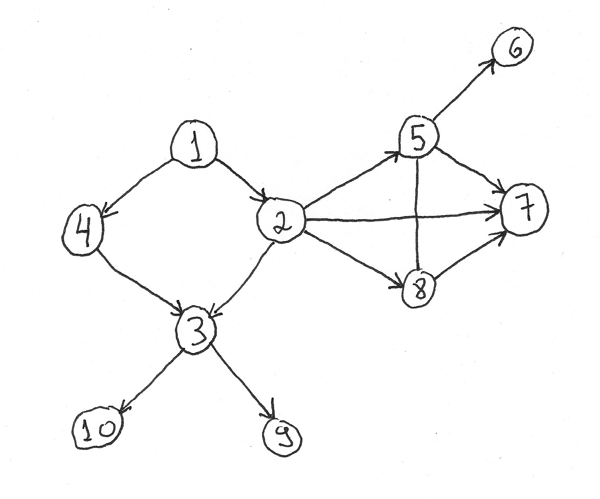

# greenbook

This project contains Java implementations for a sort of problems using data structures and algorithms

#### org.greenbook.TrigoSpiralMatrix

Given an input N x M matrix `int[][]`, prints its elements in spiral, starting from position `[0][0]`.

Implementation uses trigonometric functions to control iteration over elements. 

Example 1:

Matrix 2 x 2

Input:

|   |   |
|---|---|
| 1 | 2 | 
| 3 | 4 | 

Output: 

1 2 4 3

Example 2:

Matrix 5 x 3

Input:

|    |    |    |
|----|----|----|
|  1 |  2 |  3 |
|  4 |  5 |  6 |
|  7 |  8 |  9 |
| 10 | 11 | 12 |
| 13 | 14 | 15 |

Output: 

1 2 3 6 9 12 15 14 13 10 7 4 5 8 11

#### org.greenbook.RotateMatrix

Given an input N x N matrix `int[][]`, executes an in-place rotation of its elements, in the counterclockwise direction.

Example:

Matrix 4 x 4

Input:

|    |    |    |    |
|----|----|----|----|
|  1 |  2 |  3 |  4 |
|  5 |  6 |  7 |  8 |
|  9 | 10 | 11 | 12 |
| 13 | 14 | 15 | 16 |

After rotation:

|    |    |    |    |
|----|----|----|----|
|  4 |  8 | 12 | 16 |
|  3 |  7 | 11 | 15 |
|  2 |  6 | 10 | 14 |
|  1 |  5 |  9 | 13 |

#### org.greenbook.BFS

Given an tree of `TreeNode`, starting from a node considered its root, prints all elements using breadth-first search

Example 1:

Input:

Output - considering node 1 as root node.

1 4 2 3 5 7 8 10 9 6

Example 2:

Input - a tree with nodes and respective children:

1 -> 2, 3

2 -> 4, 5

3 -> 6, 7

4 -> 8

6 -> 9

7 -> 10

Output - considering node 1 as root node.

1 2 3 4 6 7 8 9 10

#### org.greenbook.DFS

Given an tree of `TreeNode`, starting from a node considered its root, prints all elements using depth-first search

Example 1:

Input:

Output - considering node 1 as root node.

1 4 3 10 9 2 8 7 5 6

Example 2:

Input - a tree with nodes and respective children:

1 -> 2, 3

2 -> 4, 5

3 -> 6, 7

4 -> 8

5 -> 11, 12

6 -> 9

7 -> 10

11 -> 13

13 -> 14

Output - considering node 1 as root node.

1 2 4 8 5 11 13 14 12 3 6 9 7 10

#### org.greenbook.AdjacentDuplicateRemover

Giver an input string, remove adjacent duplicate characters. If removing a sequence of duplicate characters results in a string with a new duplicate sequence, this new one must be removed too.

Examples:

Input: pqqprq -> Output: rq

Input: abcde -> Output: abcde

Input: aabcc -> Output: b

Input: pqqqprqaa -> Output: rq

Input: abba -> Output: empty string

#### org.greenbook.BinaryTreeBoundary

Given a tree, prints its boundary elements

#### org.greenbook.GroupEvenOddLinkedList

Given a linked list of Integer elements, regroup them, having even ones as head and odd ones as tail

#### org.greenbook.tree.Tree

Creates a tree and provides a iterator for its elements 

#### org.greenbook.Combinator

Given a list of values, return their combinations

Example:

Input: [1, 2, 3, 3]

Output: [[1], [1, 2], [2], [1, 3], [1, 2, 3], [2, 3], [3], [1, 4], [1, 2, 4], [2, 4], [1, 3, 4], [1, 2, 3, 4], [2, 3, 4], [3, 4], [4]]

---

If you are wondering why the name greenbook, it worth saying that it is not related to the movie of same name, released in 2018, directed by Peter Farelly, and starred by Viggo Mortesen and Mahersala Ali.

The name was inspired by the front cover of the book Cracking the coding interview, written by Gayle Laakmann McDowell, 6th edition.