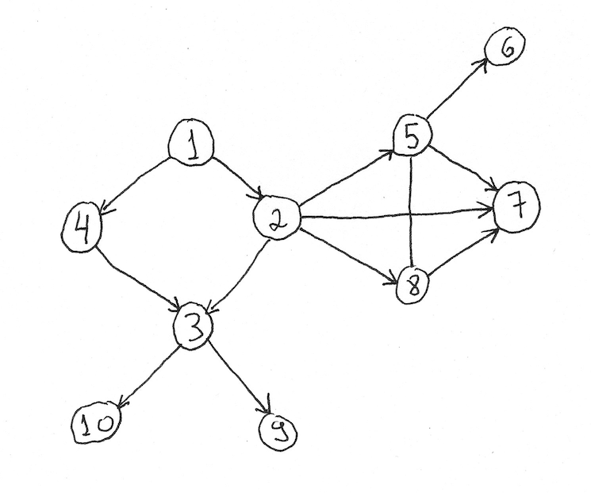

#### org.greenbook.BFS

Given an tree of `TreeNode`, starting from a node considered its root, prints all elements using breadth-first search

Example 1:

Input:

Output - considering node 1 as root node.

1 4 2 3 5 7 8 10 9 6

Example 2:

Input - a tree with nodes and respective children:

1 -> 2, 3

2 -> 4, 5

3 -> 6, 7

4 -> 8

6 -> 9

7 -> 10

Output - considering node 1 as root node.

1 2 3 4 6 7 8 9 10